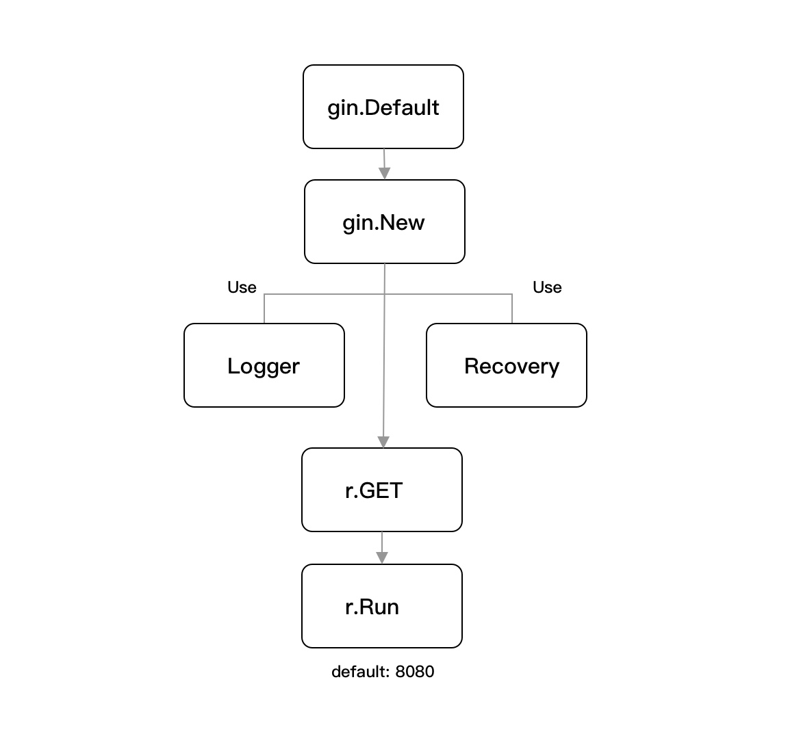

# 2.1 开启博客之路

## 2.1.1 用什么

本次博客项目将选用 gin 框架来完成开发，gin 是用 Go 编写的一个 HTTP Web 框架，它具有类似于 Martini 的 API 风格，并且它使用了著名的开源项目 httprouter 的自定义版本作为路由基础，使得它的性能表现更高更好，相较 Martini 大约提高了 40 倍。

另外 gin 除了快以外，还具备小巧、精美且易用的特性，目前广受 Go 语言开发者的喜爱，是最流行的 HTTP Web 框架（从 Github Star 上来看），趋势如下：


在这里需要注意的是，框架，仅仅只是一个 ”工具“，不要过度被局限于此，应当尽可能的学习其原理和思路，而我们在本文中所实现的功能，在实际操作上来讲，在任何框架上也能再实现一遍，因此学懂它，非常重要，这也是我所倡导的。

## 2.1.2 初始化项目

开始之前，我们通过如下命令初始化博客项目（若为 Windows 系统，可根据实际情况自行调整项目的路径）：

```shell
$ mkdir -p $HOME/go-programming-tour-book/blog-service
$ cd $HOME/go-programming-tour-book/blog-service
$ go mod init github.com/go-programming-tour-book/blog-service
```

在执行命令完毕后，我们就已经完成了初始化项目的第一步。

## 2.1.3 安装

接下来我们安装 gin 的相关联模块，执行如下命令：

```shell
$ go get -u github.com/gin-gonic/gin@v1.6.3
```

在安装完毕后，我们可以看到项目根目录下的 go.mod 文件也会发生相应的改变，打开 go.mod 文件，查看如下：

```shell
module github.com/go-programming-tour-book/blog-service

go 1.14

require (
	github.com/gin-gonic/gin v1.6.3 // indirect
	github.com/go-playground/universal-translator v0.17.0 // indirect
	...
)
```

这些正正就是 gin 所相关联的所有模块包，这里你可能会好奇，为什么 `github.com/gin-gonic/gin` 后面会出现 indirect 标识，它明明是我们直接通过调用 `go get` 引用的，其实不然，是因为在我们安装时，这个项目模块还没有真正的去使用它所导致的（Go modules 会分析项目下的依赖情况来决定）。

另外你会注意到，在 go.mod 文件中有类似 `go 1.14` 这样的标识位，目前来讲暂时没有明确的实际作用，主要与你创建 Go modules 时的 Go 版本有关。

## 2.1.4 快速启动

在完成前置动作后，在本节我们先将一个 Demo 运行起来，看看一个最简单的 HTTP 服务运行起来是怎么样的，我们回到 blog-service 的项目根目录下，新建一个 main.go 文件，代码如下：

```go
func main() {
    r := gin.Default()
    r.GET("/ping", func(c *gin.Context) {
        c.JSON(200, gin.H{"message": "pong"})
    })
    r.Run()
}
```

接下来我们运行 main.go 文件，查看运行结果，如下：

```shell
$ go run main.go 
[GIN-debug] [WARNING] Creating an Engine instance with the Logger and Recovery middleware already attached.
...
[GIN-debug] GET    /ping                     --> main.main.func1 (3 handlers)
[GIN-debug] Environment variable PORT is undefined. Using port :8080 by default
[GIN-debug] Listening and serving HTTP on :8080
```

我们可以看到启动了服务后，输出了许多运行信息，如果你第一次看，可能会有些懵，在这里我们对运行信息做一个初步的概括分析，分为以下四大块：

- 默认 Engine 实例：当前默认使用了官方所提供的 Logger 和 Recovery 中间件创建了 Engine 实例。
- 运行模式：当前为调试模式，并建议若在生产环境时切换为发布模式。
- 路由注册：注册了 `GET /ping` 的路由，并输出其调用方法的方法名。
- 运行信息：本次启动时监听 8080 端口，由于没有设置端口号等信息，因此默认为 8080。

## 2.1.5 验证

在启动之后，这个服务就已经对外提供了服务，我们只需针对所配置的端口号和设置的路由规则进行请求，就可以得到响应结果了，如下：

```shell
$ curl http://localhost:8080/ping
{"message":"pong"}
```

响应结果与我们的预期一致，该服务运行正确。

## 2.1.6 分析

你可能会在想，我们只是通过简单的几段代码，居然就完成了一个“强劲”的 HTTP 服务，这底下有什么处理逻辑，一些服务端参数它们是在哪里设置的，那么多的调试信息又是在哪里输出的，能不能关掉呢，我们接下来对源码进行大体分析，一探究竟，简单的解剖一下里面的秘密，整体分析流程如下：



### 2.1.6.1 gin.Default

```go
func Default() *Engine {
	debugPrintWARNINGDefault()
	engine := New()
	engine.Use(Logger(), Recovery())
	return engine
}
```

我们会通过调用 `gin.Default` 方法来创建默认的 Engine 实例，它会在初始化阶段就引入 Logger 和 Recovery 中间件，能够保障你应用程序的最基本运作，这两个中间件具有以下作用：

- Logger：输出请求日志，并标准化日志的格式。
- Recovery：异常捕获，也就是针对每次请求处理进行 recovery 处理，防止因为出现 panic 导致服务崩溃，并同时标准化异常日志的格式。

另外在调用 `debugPrintWARNINGDefault` 方法时，会检查 Go 版本是否达到 gin 的最低要求，再进行调试的日志 `[WARNING] Creating an Engine instance with the Logger and Recovery middleware already attached.` 的输出，用于提醒开发人员框架内部已经默认检查和集成了缺省值。

### 2.1.6.2 gin.New

最重要的莫过于 `New` 方法，因为该方法会进行 Engine 实例的初始化动作并返回，它在 gin 中承担了主轴的作用，那在初始化时会设置什么参数，是否会影响到我们的日常开发呢，我们继续一起深入探究，代码如下：

```go
func New() *Engine {
	debugPrintWARNINGNew()
	engine := &Engine{
		RouterGroup: RouterGroup{
			Handlers: nil,
			basePath: "/",
			root:     true,
		},
		FuncMap:                template.FuncMap{},
		RedirectTrailingSlash:  true,
		RedirectFixedPath:      false,
		HandleMethodNotAllowed: false,
		ForwardedByClientIP:    true,
		AppEngine:              defaultAppEngine,
		UseRawPath:             false,
		UnescapePathValues:     true,
		MaxMultipartMemory:     defaultMultipartMemory,
		trees:                  make(methodTrees, 0, 9),
		delims:                 render.Delims{Left: "{{", Right: "}}"},
		secureJsonPrefix:       "while(1);",
	}
	engine.RouterGroup.engine = engine
	engine.pool.New = func() interface{} {
		return engine.allocateContext()
	}
	return engine
}
```

- RouterGroup：路由组，所有的路由规则都由 `*RouterGroup` 所属的方法进行管理，在 gin 中和 Engine 实例形成一个重要的关联组件。
- RedirectTrailingSlash：是否自动重定向，如果启用了，在无法匹配当前路由的情况下，则自动重定向到带有或不带斜杠的处理程序去。例如：当外部请求了 `/tour/` 路由，但当前并没有注册该路由规则，只有 `/tour` 的路由规则时，将会在内部进行判定，若是 HTTP GET 请求，将会通过 HTTP Code 301 重定向到 `/tour` 的处理程序去，但若是其他类型的 HTTP 请求，那么将会是以 HTTP Code 307 重定向。，通过指定的 HTTP 状态码重定向到 `/tour` 路由的处理程序去。
- RedirectFixedPath：是否尝试修复当前请求路径，也就是在开启的情况下，gin 会尽可能的帮你找到一个相似的路由规则并在内部重定向过去，主要是对当前的请求路径进行格式清除（删除多余的斜杠）和不区分大小写的路由查找等。
- HandleMethodNotAllowed：判断当前路由是否允许调用其他方法，如果当前请求无法路由，则返回 Method Not Allowed（HTTP Code 405）的响应结果。如果无法路由，也不支持重定向其他方法，则交由 NotFound Hander 进行处理。
- ForwardedByClientIP：如果开启，则尽可能的返回真实的客户端 IP，先从 X-Forwarded-For 取值，如果没有再从 X-Real-Ip。
- UseRawPath：如果开启，则会使用 `url.RawPath` 来获取请求参数，不开启则还是按 url.Path 去获取。
- UnescapePathValues：是否对路径值进行转义处理。
- MaxMultipartMemory：相对应 `http.Request ParseMultipartForm` 方法，用于控制最大的文件上传大小。
- trees：多个压缩字典树（Radix Tree），每个树都对应着一种 HTTP Method。你可以理解为，每当你添加一个新路由规则时，就会往 HTTP Method 对应的那个树里新增一个 node 节点，以此形成关联关系。
- delims：用于 HTML 模板的左右定界符。

总的来讲，Engine 实例就像引擎一样，与整个应用的运行、路由、对象、模板等管理和调度都有关联，另外通过上述的解析，你可以发现其实 gin 在初始化默认已经替我们做了很多事情，可以说是既定了一些默认运行基础。

### 2.1.6.3 r.GET

我们在注册路由时，使用了 `r.GET` 方法来将定义的路由注册进去，我们一起去看看它到底注册了什么，如下：

```go
func (group *RouterGroup) handle(httpMethod, relativePath string, handlers HandlersChain) IRoutes {
	absolutePath := group.calculateAbsolutePath(relativePath)
	handlers = group.combineHandlers(handlers)
	group.engine.addRoute(httpMethod, absolutePath, handlers)
	return group.returnObj()
}
```

- 计算路由的绝对路径，也就是 `group.basePath` 与我们定义的路由路径组装，那么 group 又是什么东西呢，实际上在 gin 中存在组别路由的概念，这个知识点在后续实战中会使用到。
- 合并现有和新注册的 Handler，并创建一个函数链 HandlersChain。
- 将当前注册的路由规则（含 HTTP Method、Path、Handlers）追加到对应的树中。

这类方法主要是针对路由的各类计算和注册行为，并输出路由注册的调试信息，如运行时的路由信息：

```shell
[GIN-debug] GET    /ping                     --> main.main.func1 (3 handlers)
```

另外不知道你有没有注意到这条调试信息的最后，显示的是 `3 handlers`，这是为什么呢，明明我们只注册了 `/ping` 这一条路由而已，是不是应该是一个 Handler。其实不然，我们看看上述创建函数链 HandlersChain 的详细步骤，就知道为什么了，如下：

```go
func (group *RouterGroup) combineHandlers(handlers HandlersChain) HandlersChain {
	finalSize := len(group.Handlers) + len(handlers)
	mergedHandlers := make(HandlersChain, finalSize)
	copy(mergedHandlers, group.Handlers)
	copy(mergedHandlers[len(group.Handlers):], handlers)
	return mergedHandlers
}

func (group *RouterGroup) Use(middleware ...HandlerFunc) IRoutes {
	group.Handlers = append(group.Handlers, middleware...)
	return group.returnObj()
}
```

我们可以看到在 `combineHandlers` 方法中，最终函数链 HandlersChain 的是由 `group.Handlers` 和外部传入的 `handlers` 组成的，从拷贝的顺序来看，`group.Handlers` 的优先级高于外部传入的 `handlers`。

那么以此再结合 `Use` 方法来看，很显然是在 `gin.Default` 方法中注册的中间件影响了这个结果，因为中间件也属于 `group.Handlers` 的一部分，也就是在调用 `gin.Use`，就已经注册进去了，如下：

```go
engine.Use(Logger(), Recovery())
```

因此我们所注册的路由加上内部默认设置的两个中间件，最终使得显示的结果为 `3 handlers`。

### 2.1.6.4 r.Run

支撑我们实际运行 HTTP Server 的 Run 方法，我们一起看看它都做了什么，如下：

```go
func (engine *Engine) Run(addr ...string) (err error) {
	defer func() { debugPrintError(err) }()

	address := resolveAddress(addr)
	debugPrint("Listening and serving HTTP on %s\n", address)
	err = http.ListenAndServe(address, engine)
	return
}
```

该方法会通过解析地址，再调用 `http.ListenAndServe` 将 Engine 实例作为 `Handler` 注册进去，然后启动服务，开始对外提供 HTTP 服务。

这里值得关注的是，为什么 Engine 实例能够传进去呢，明明形参要求的是 `Handler` 接口类型。这块如果你有了解过 Go 语言的相关基础知识的话，应该会知道，实际上在 Go 语言中如果某个结构体实现了 interface 定义声明的那些方法，那么就可以认为这个结构体实现了 interface。

那么在 gin 中，Engine 这一个结构体确确实实是实现了 `ServeHTTP` 方法的，也就是符合 `http.Handler` 接口标准，代码如下：

```go
func (engine *Engine) ServeHTTP(w http.ResponseWriter, req *http.Request) {
	c := engine.pool.Get().(*Context)
	c.writermem.reset(w)
	c.Request = req
	c.reset()

	engine.handleHTTPRequest(c)
	engine.pool.Put(c)
}
```

- 从 `sync.Pool` 对象池中获取一个上下文对象。
- 重新初始化取出来的上下文对象。
- 处理外部的 HTTP 请求。
- 处理完毕，将取出的上下文对象返回给对象池。

在这里上下文的池化主要是为了防止频繁反复生成上下文对象，相对的提高性能，并且针对 gin 本身的处理逻辑进行二次封装处理。

## 2.1.7 小结

我们在本章节中介绍了目前 Go 语言中比较流行的 gin 框架，并且使用它完成了一个简单的 HTTP Server。同时我们还基于示例代码，对其进行了源码分析，因为作为一个开发人员，我们不仅只是做到使用，我们还应该了解到它底层是具体什么实现，要知道了会做什么默认设置，输出的调试信息又是因何原因与我们所最初期望的不一样，尽可能的做到知其然知其所以然，又能更好的使用它，而不是被使用。

------


本图书由[ 煎鱼 ](https://github.com/eddycjy)©2020 版权所有